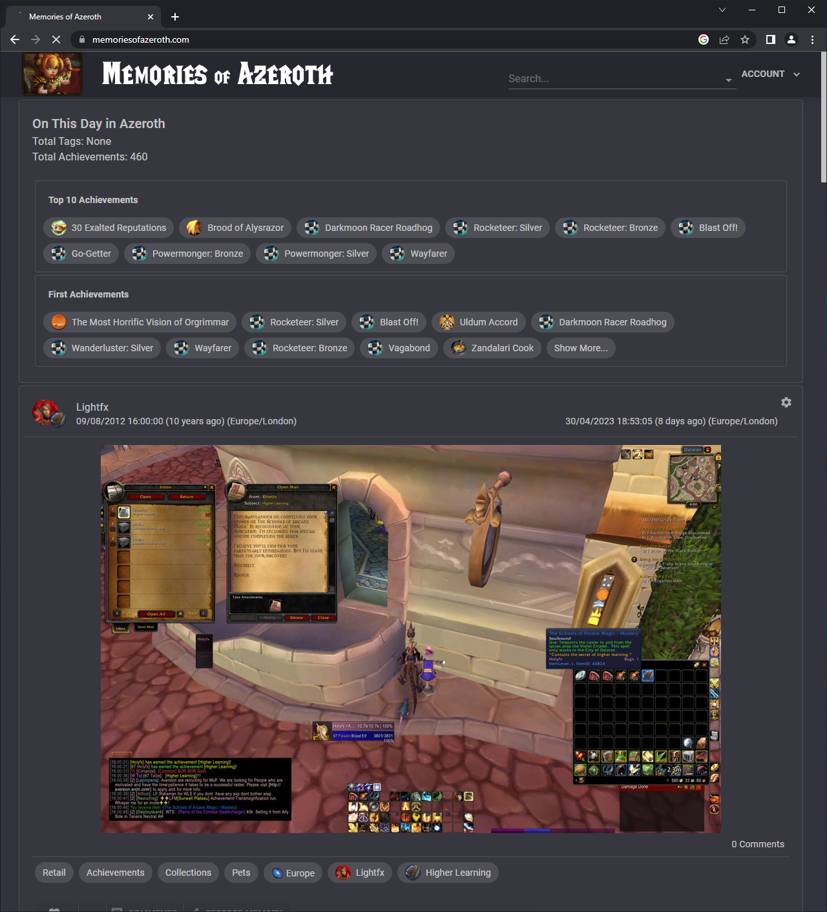
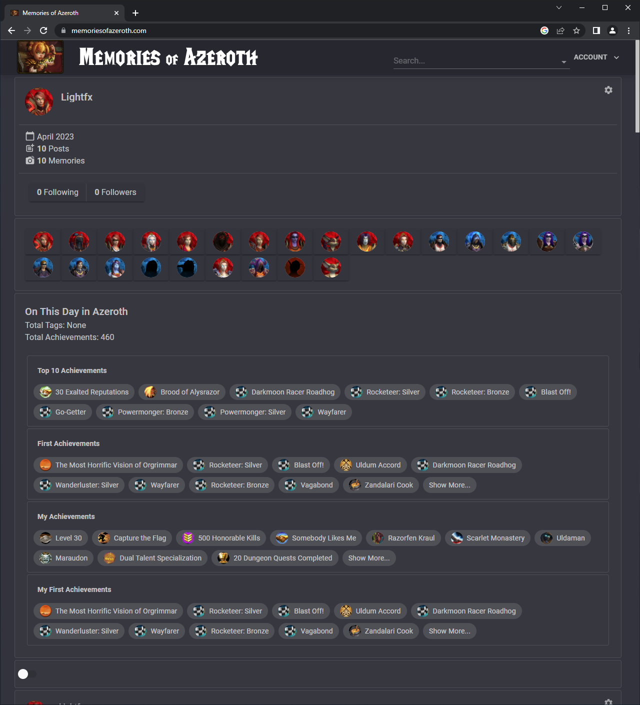
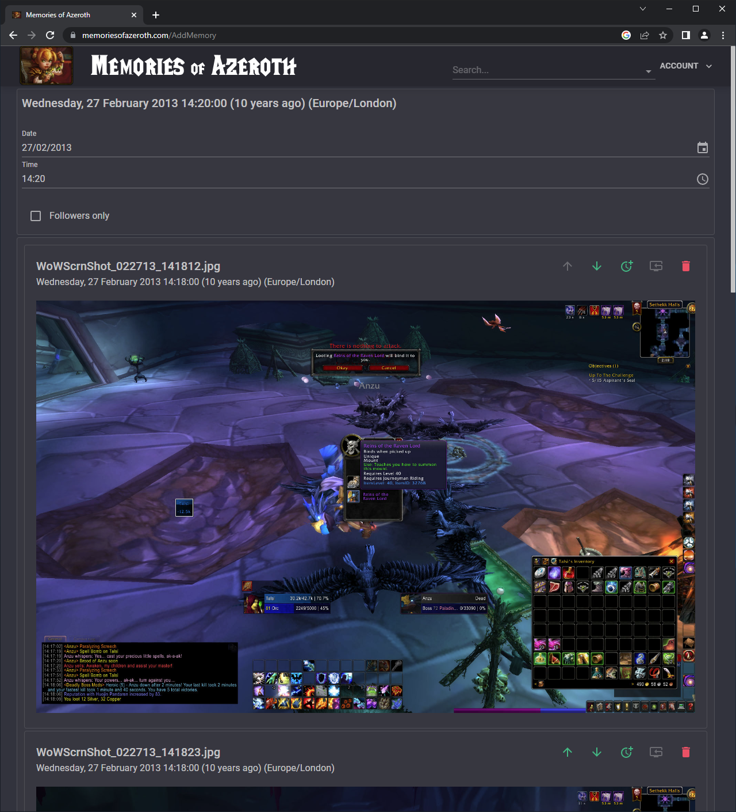
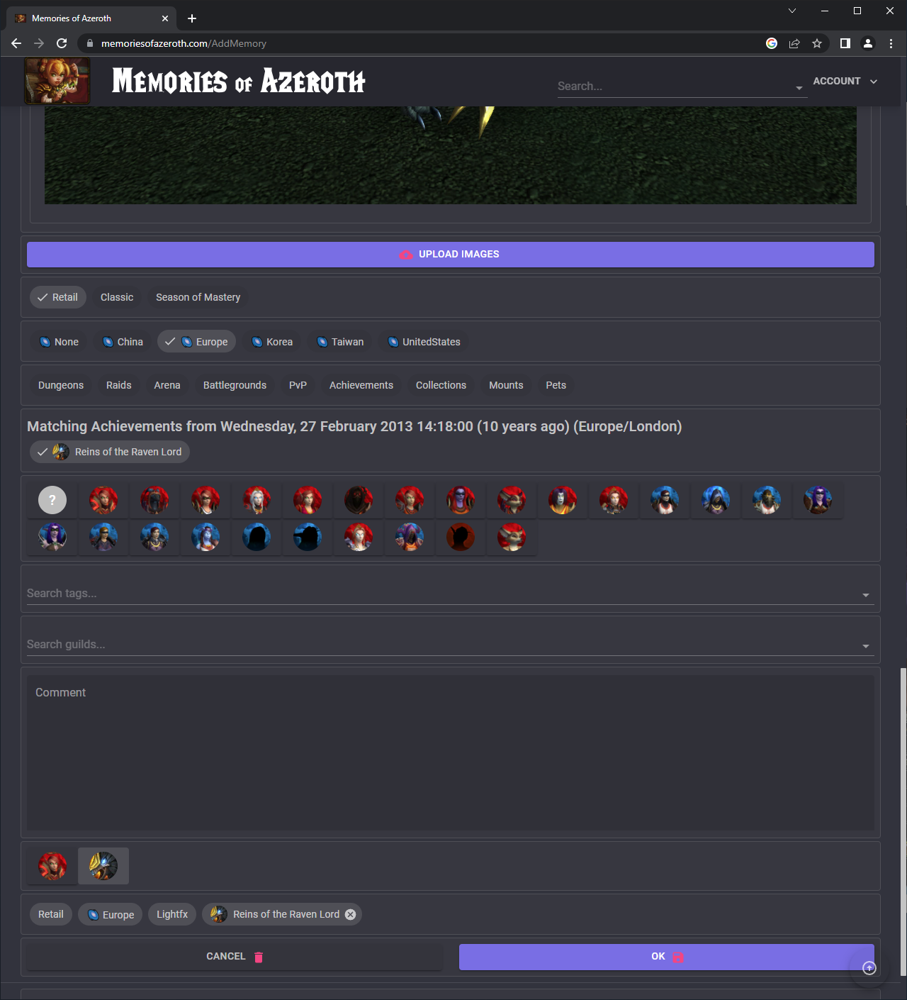
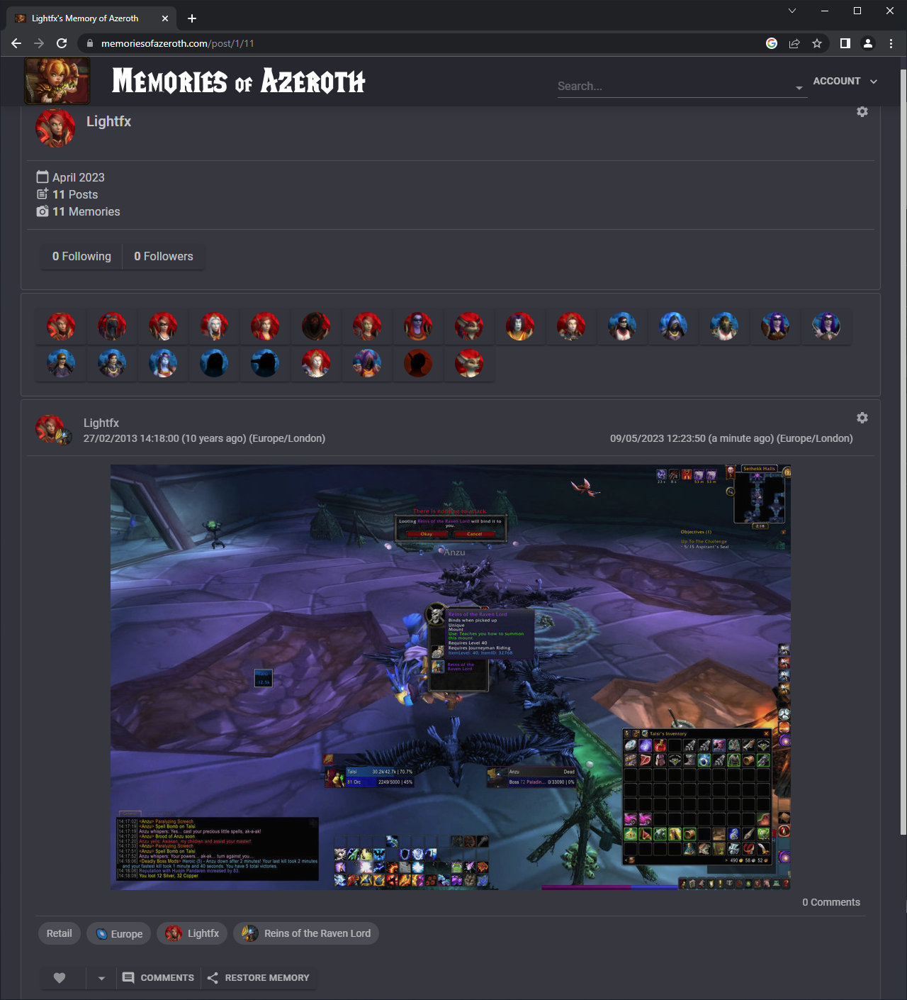

# AzerothMemories

Code behind [Memories of Azeroth](https://memoriesofazeroth.com)

## Projects Used

* [ArgentPonyWarcraftClient](https://github.com/blizzard-net/warcraft)
* [AspNet.Security.OAuth.Providers](https://github.com/aspnet-contrib/AspNet.Security.OAuth.Providers)
* [AzureStorage](https://github.com/Azure/azure-sdk-for-net/blob/Azure.Storage.Blobs_12.16.0/sdk/storage/Azure.Storage.Blobs/README.md)
* [Blazor](https://dotnet.microsoft.com/en-us/apps/aspnet/web-apps/blazor)
* [BlazorWasmAntivirusProtection](https://github.com/stavroskasidis/BlazorWasmAntivirusProtection)
* [CsvHelper](https://joshclose.github.io/CsvHelper)
* [EntityFrameworkCore](https://learn.microsoft.com/en-us/ef/core/)
* [FluentAssertions ](https://fluentassertions.com)
* [FluentMigrator](https://github.com/fluentmigrator/fluentmigrator/wiki)
* [Humanizer](https://github.com/Humanizr/Humanizer)
* [ImageSharp](https://github.com/SixLabors/ImageSharp)
* [MarkDig](https://github.com/lunet-io/markdig)
* [MudBlazor](https://mudblazor.com)
* [NodaTime](https://nodatime.org)
* [Stl.Fusion](https://github.com/servicetitan/Stl.Fusion)

## Screenshots

